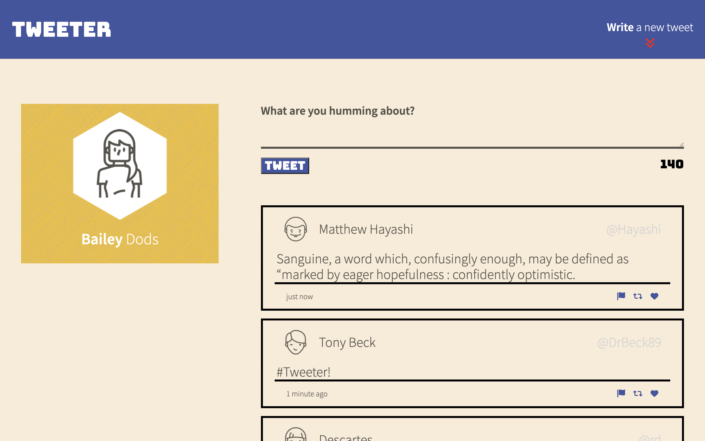
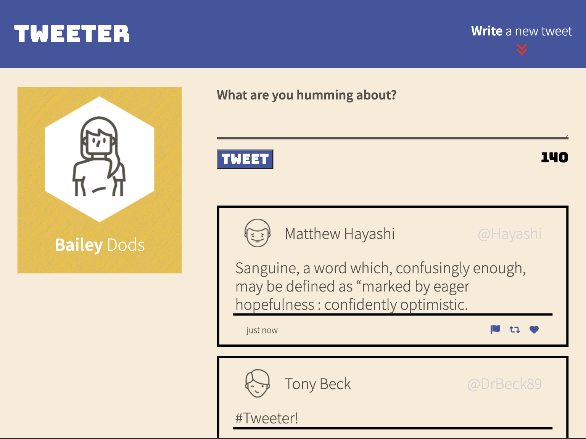
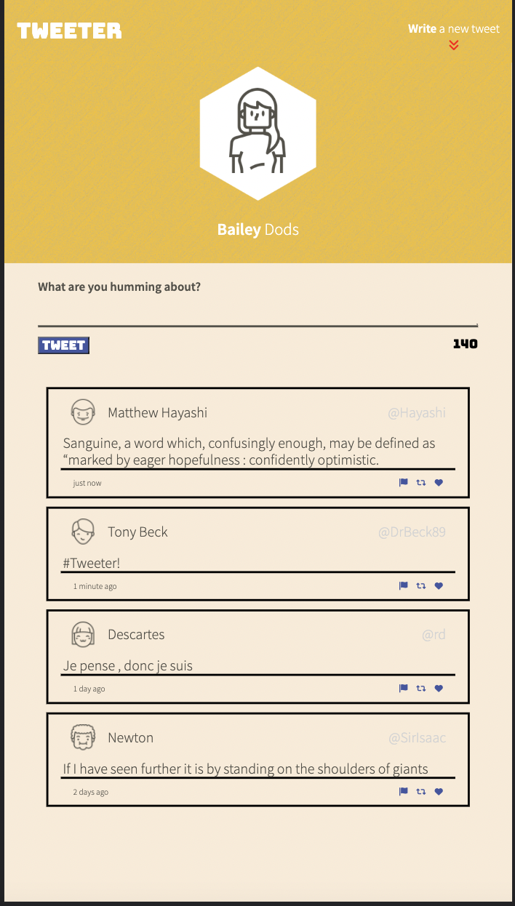

# Tweeter 🐣

## Tweeter is a simple single page app built with HTML, CSS, JavaScript, Jquery and AJAX.
  
  This app leverages the languages stated above to asynchronously retrieve and post Tweets without a single page refresh.

  Utilizing these programs allowed me to create a dynamic Tweeter template which includes,
  - Timestamps on each post.
  - A user profile picture and name.
  - A users profile handle.
  - The Tweet text.
  - And actions on the tweet (re-tweet, like, flag/report).

  This application was built with responsive web design in mind giving the user an optimized experience with any screen.
  
### Attention this app was created for learning purposes only.
#### Screenshots (Desktop, Ipad (landscape), Iphone).

## Getting Started

1. [Create](https://docs.github.com/en/repositories/creating-and-managing-repositories/creating-a-repository-from-a-template) a new repository using this repository as a template.
2. Clone your repository onto your local device.
3. Install dependencies using the `npm install` command.
3. Start the web server using the `npm run local` command. The app will be served at <http://localhost:8080/>.
4. Go to <http://localhost:8080/> in your browser.

## Dependencies

- Express 4.13.4
- Node 5.10.x or above
- body-parser 1.15.2
- chance 1.0.2
- md5 2.1.0
- timeago.js
